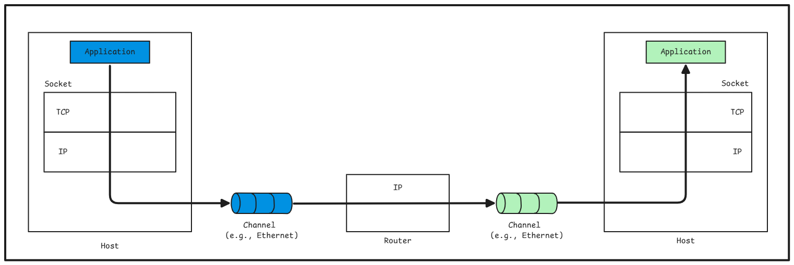
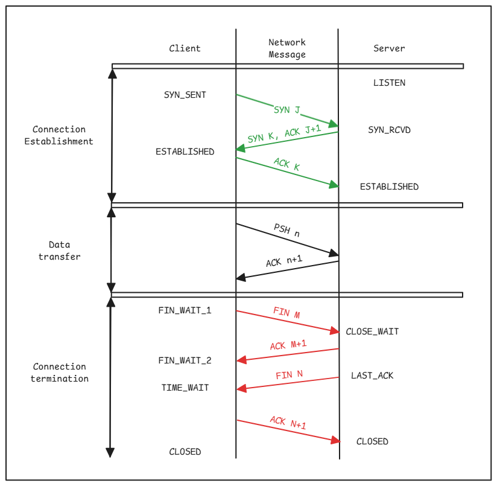
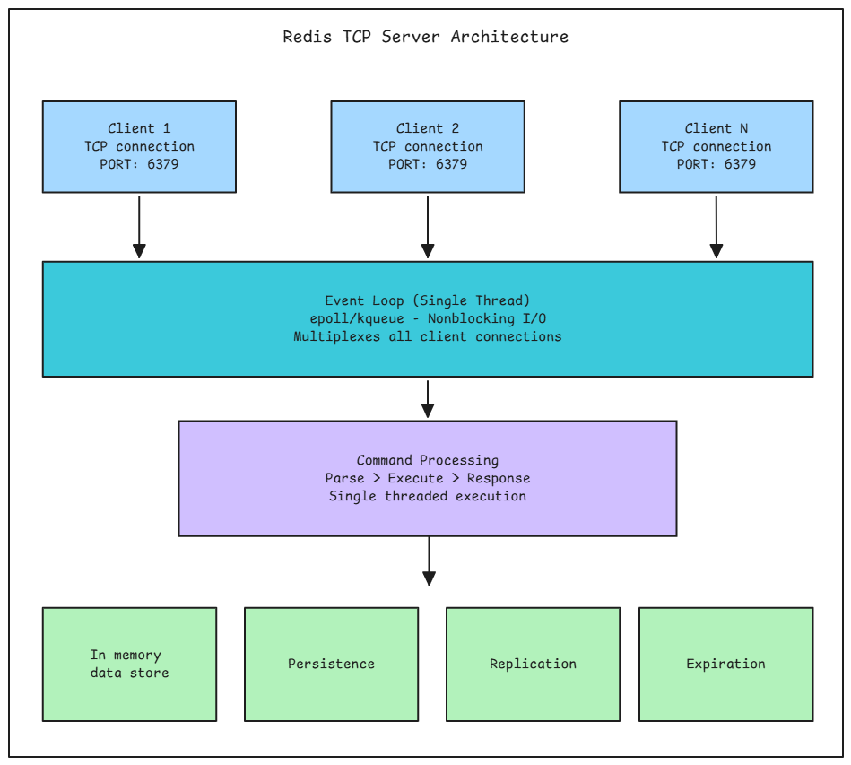

# Building a Minimal TCP Server in Python

A TCP server is a program that listens for incoming connections from clients over the Transmission Control Protocol (TCP), a reliable, connection-oriented protocol in the TCP/IP suite. TCP ensures data is delivered in order, without loss or duplication, using mechanisms like acknowledgments and retransmissions. TCP servers are the backbone of many networked applications, including Redis, which uses TCP to communicate between clients and the server. The server accepts connections, processes client requests, and sends responses, typically following a client-server model.

---

_Diagram source: TCP/IP Sockets in C: Practical Guide for Programmers_


# Key Characteristics of TCP

### Reliable

Ensures data is delivered in order, without loss or duplication, using acknowledgments and retransmissions.

### Connection-Oriented

Establishes a persistent connection (via a handshake) before data exchange.

### Stream-Based

Data is sent as a continuous stream of bytes, not packets, with no inherent message boundaries.

---

## Redis and TCP

Redis, a high-performance in-memory data store, uses a TCP server (default port **6379**) to accept client connections and process commands formatted in **RESP**.

# TCP Connection Lifecycle

A TCP server operates in a well-defined sequence:

### 1. Socket Creation

The server creates a socket, a software abstraction for network communication.

### 2. Binding

The server binds the socket to a specific IP address (e.g., localhost or 0.0.0.0) and port (e.g., 6379).

### 3. Listening

The server sets the socket to listen for incoming connections, specifying a backlog (queue size for pending connections).

### 4. Accepting Connections

When a client connects, the server accepts the connection, creating a new socket for communication with that client.

### 5. Data Exchange

The server reads data from the client (e.g., commands), processes it, and sends responses.

### 6. Connection Termination

The server or client closes the connection when done.

---

## Connection Establishment

The process of connecting a network for TCP communication involves three requests and responses to check and connect to the port:

1. **Sending SYN data from client to server** (connection request)

   - When the server receives SYN data, the port receiving the request changes its status from `LISTEN → SYN_RCV`.

2. **Server sends ACK + SYN to client**

   - `ACK` → Request received successfully
   - `SYN` → Open the port

3. **Client receives ACK+SYN**

   - Changes status from `CLOSED → ESTABLISHED` and sends ACK to the server.

4. **Server receives ACK**
   - Status changes from `SYN_RCV → ESTABLISHED`.

Connection is complete when both ports are `ESTABLISHED`.

---

## Connection Termination

1. Client sends `FIN` flag → `FIN-WAIT` state
2. Server receives `FIN` and sends an `ACK` → `CLOSE_WAIT` state (waits until it has finished sending its data)
3. When the server is ready to close the connection, it sends `FIN` to the client → `LAST_ACK` state
4. If the client receives `FIN` and is ready to cancel, it sends `ACK` → `TIME-WAIT` state
5. The client waits for `MSL * 2` and then returns to `CLOSED` state

---



# Socket Communication

A socket is an endpoint for network communication, allowing programs to send and receive data over a network. In Python, the `socket` module provides low-level access to sockets. Sockets operate at the transport layer (TCP/UDP) and abstract the complexities of network protocols.

---


# Key Socket Concepts

## Socket Types

- **AF_INET**: Uses IPv4 for communication (most common for TCP servers).
- **SOCK_STREAM**: Indicates TCP (reliable, stream-based) vs. **SOCK_DGRAM** for UDP (datagram-based).

## Socket Methods

- **socket()**: Creates a new socket.
- **bind((host, port))**: Associates the socket with an address and port.
- **listen(backlog)**: Enables the socket to accept connections, with a queue for pending connections.
- **accept()**: Blocks until a client connects, returning a new socket and client address.
- **recv(size)**: Reads up to `size` bytes from the socket.
- **send(data)**: Sends data to the connected client.
- **close()**: Terminates the socket.

## Client-Server Handshake

- The client initiates a connection with a TCP three-way handshake: `SYN → SYN-ACK → ACK`.
- The server’s `accept()` call completes when the handshake finishes, establishing a connection.

# Redis’s TCP Server Model (Single-threaded Event Loop)

Redis operates on a single-threaded event loop model for command processing, which eliminates the complexity of thread synchronization and makes it extremely fast for most operations.

---



# Client Connections & Event Loop

## Client Connections

Multiple clients connect via TCP to Redis (default port **6379**). Each maintains a persistent connection.

## Event Loop

The heart of Redis uses an event-driven, non-blocking I/O model (epoll on Linux, kqueue on BSD/macOS). This single thread:

- Accepts new connections
- Reads commands from clients
- Processes commands sequentially
- Writes responses back to clients

---


## Command Processing

All commands execute atomically in a single thread, ensuring data consistency without locks.

## In-Memory Data Structures

Redis stores data entirely in RAM using optimized data structures such as strings, hashes, lists, sets, sorted sets, and more.

## Background Operations

Heavy operations like persistence (RDB snapshots, AOF rewrites) and replication run in separate background processes or threads to avoid blocking the main event loop.

# Implementing a Minimal TCP Server

In this lab, we will implement a simple TCP server in Python that:

- Listens on `localhost:6379` (Redis’s default port).
- Accepts multiple client connections using threading.
- Responds to a `PING` command with `PONG` and handles unknown commands.
- Closes connections gracefully when clients disconnect.

This server will serve as the foundation for later labs, where we’ll add RESP parsing and a key-value store.

# Implementation

Create a file named `tcp_server.py` and add the following code:

```python
import socket
import threading

class TCPServer:
    def __init__(self, host='localhost', port=6379):
        self.server_socket = socket.socket(socket.AF_INET, socket.SOCK_STREAM)
        self.server_socket.setsockopt(socket.SOL_SOCKET, socket.SO_REUSEADDR, 1)  # Allow port reuse
        self.server_socket.bind((host, port))
        self.server_socket.listen(5)  # Backlog of 5 connections
        print(f"Server listening on {host}:{port}")

    def handle_client(self, conn, addr):
        print(f"Connected by {addr}")
        try:
            while True:
                data = conn.recv(1024).decode().strip()
                if not data:
                    break  # Client disconnected
                if data.upper() == "PING":
                    conn.send(b"+PONG\r\n")
                else:
                    conn.send(b"-ERR Unknown command\r\n")
        except Exception as e:
            conn.send(f"-ERR {str(e)}\r\n".encode())
        finally:
            conn.close()
            print(f"Disconnected: {addr}")

    def run(self):
        try:
            while True:
                conn, addr = self.server_socket.accept()
                # Start a new thread for each client
                threading.Thread(target=self.handle_client, args=(conn, addr)).start()
        except KeyboardInterrupt:
            print("\nShutting down server...")
        finally:
            self.server_socket.close()

if __name__ == "__main__":
    server = TCPServer()
    server.run()

```

## Run the Server

1. Save the code as `tcp_server.py`.
2. Execute the following command:

```bash
python tcp_server.py
```

# Test the Server

1. Open a terminal and run:

```bash
telnet localhost 6379

```
